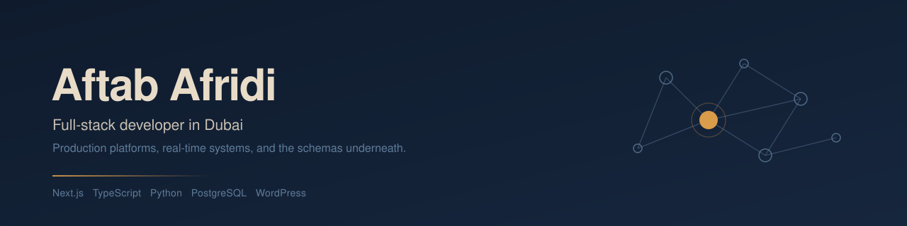

I build production web applications and the backends that hold them up — schema design, API layers, authentication, real-time systems, and the third-party integrations that are usually the hardest part. Six years in, most recently on Next.js and TypeScript, with a long WordPress background before that.
 
Based in Dubai. Currently building [Foundly](https://foundly.ae).
 
---
 
## What I'm working on
 
**[Foundly](https://foundly.ae)** — a bilingual English/Arabic lost-and-found marketplace for the UAE. Founded it, built it, run it.
 
Next.js 16 · TypeScript · PostgreSQL · Prisma · Socket.IO
 
83 API endpoints and a 23-model schema, with English and Arabic modeled as first-class columns rather than bolted on through a translation layer. The core of it is a matching engine that scores lost and found listings against each other 0–100 using token similarity with a custom stemmer, category and city hierarchy traversal, and date proximity — then fans matches out over in-app, web push, and email without blocking the moderation queue. Real-time chat runs on Socket.IO with JWT verification at handshake and server-side room-membership checks. Self-hosted on Ubuntu behind nginx with PM2 cluster mode.
 
Also live in Pakistan at [foundly.pk](https://foundly.pk).
 
**WhatsApp business operations platform** *(private — employer work)*
 
Next.js 15 · React 19 · PostgreSQL · Python · FastAPI
 
A team inbox, visual bot-flow builder, campaign engine, and order management system behind one internal application — 176 API handlers over a 23-model schema. Real-time multi-agent inbox built on Server-Sent Events over PostgreSQL `LISTEN/NOTIFY`, and a campaign queue that claims work with `FOR UPDATE SKIP LOCKED` so overlapping cron runs can't double-send. Nine external integrations including Meta's WhatsApp Cloud API, Shopify, WooCommerce, and a payment gateway — which meant implementing RSA-OAEP/AES-GCM decryption for Meta's encrypted Flows spec and AES-128-CBC for gateway callbacks. The customer-facing bot is a separate Python/FastAPI service on Cloud Run.
 
---
 
## Stack
 
| | |
|---|---|
| **Languages** | TypeScript, JavaScript, Python, PHP, SQL |
| **Frontend** | Next.js (App Router), React, Tailwind CSS, Radix UI, shadcn/ui |
| **Backend** | Node.js, FastAPI, REST APIs, Server-Sent Events, Socket.IO, Zod |
| **Data** | PostgreSQL, Prisma, raw SQL, asyncpg, schema design and migrations |
| **Auth & security** | NextAuth, custom session auth, JWT, bcrypt, RBAC, rate limiting, HMAC webhooks, AES/RSA |
| **Integrations** | Meta WhatsApp Cloud API, Instagram, OpenAI, Shopify, WooCommerce, Google Cloud Storage, Google Sheets |
| **AI** | OpenAI API — intent classification, vision and audio pipelines, caching and usage governance |
| **Infrastructure** | Google Cloud Run, Docker, PM2, nginx, Ubuntu, cron, automated backups |
| **Automation** | n8n, Make.com, webhook orchestration |
| **WordPress** | Custom themes and plugins, WooCommerce, Crocoblock/JetEngine, ACF, REST API |
 
---
 
## GitHub
 

  
  

---
 
## Elsewhere
 
[Portfolio](https://affiafridi.com) · [LinkedIn](https://linkedin.com/in/affi) · affiafridi.dev@gmail.com
 
