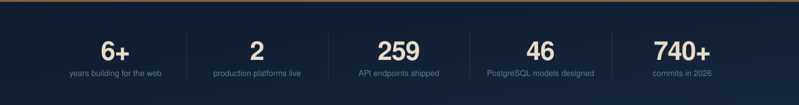

### Hey, I'm Aftab 👋

I build production web applications and the backends that hold them up — schema design, API layers, authentication, real-time systems, and the third-party integrations that are usually the hardest part.

🔭 &nbsp;Currently building **[Foundly](https://foundly.ae)**, a bilingual lost-and-found marketplace for the UAE
⚡ &nbsp;Most at home in Next.js, TypeScript and PostgreSQL — with six years of WordPress underneath
🌍 &nbsp;I ship English/Arabic products, and speak English, Urdu, Hindi and Pashto
📫 &nbsp;Reach me at **affiafridi.dev@gmail.com**

 

## 🧩 &nbsp;Foundly &nbsp;·&nbsp; founder & sole developer

A bilingual English/Arabic lost-and-found marketplace for the UAE. Built it, launched it, run it.

- **Bilingual at the schema level** — Arabic titles, descriptions and SEO fields are first-class columns, not a translation table
- **Deterministic matching engine** — scores lost↔found pairs 0–100 on token similarity with a custom stemmer, category and city hierarchy traversal, and date proximity
- **Notification fan-out** — matches reach in-app, web push and email, deduplicated by normalized pair key, off the moderation response path
- **Real-time chat** — Socket.IO authenticated by parsing NextAuth JWTs at handshake, with server-side room-membership verification
- **Two-tier caching** — in-flight request deduplication and twelve TTLs tuned per data volatility, from 10s to 12h
- **Self-hosted and operated** — PM2 cluster mode behind nginx on Ubuntu, DB-backed rate limiting that survives restarts, cron cleanup, nightly offsite backups

`83 endpoints` &nbsp;·&nbsp; `23 models` &nbsp;·&nbsp; `39 migrations` &nbsp;·&nbsp; `81 pages` &nbsp;·&nbsp; `537 commits`

 

## 💬 &nbsp;WhatsApp business operations platform

A team inbox, visual bot-flow builder, campaign engine, order management and customer CRM behind one internal application.

- **Real-time multi-agent inbox** — Server-Sent Events over PostgreSQL `LISTEN/NOTIFY` with heartbeats and clean unlisten
- **Campaign queue** — claims work with `FOR UPDATE SKIP LOCKED` so overlapping cron runs can't double-send
- **Custom session auth** — opaque tokens SHA-256 hashed at rest, five roles, dual-key per-IP and per-email rate limiting, role-scoped data masking applied in SQL
- **Nine integrations** — Meta WhatsApp Cloud API, Instagram, OpenAI, Shopify, WooCommerce, CCAvenue, Google Sheets, Cloud Storage
- **Cryptography against vendor specs** — RSA-OAEP/AES-GCM for Meta's encrypted Flows endpoint, AES-128-CBC for payment gateway callbacks
- **AI intent pipeline** — GPT-4o-mini classification, GPT-4o vision, Whisper transcription, with response caching and atomic SQL-enforced daily usage caps
- **Companion bot** — separate Python/FastAPI service on Cloud Run driving the customer-facing conversational flow

`176 handlers` &nbsp;·&nbsp; `23 models` &nbsp;·&nbsp; `36 migrations` &nbsp;·&nbsp; `5 roles` &nbsp;·&nbsp; `~45k lines`

 

## 🛠 &nbsp;Stack

|  |  |
|---|---|
| **Languages** |     |
| **Frontend** |     |
| **Backend** |     |
| **Data** |    |
| **Infrastructure** |      |
| **Integrations & AI** |     |
| **WordPress** |    |
| **Automation** |   |

 

## 🔗 &nbsp;Elsewhere

